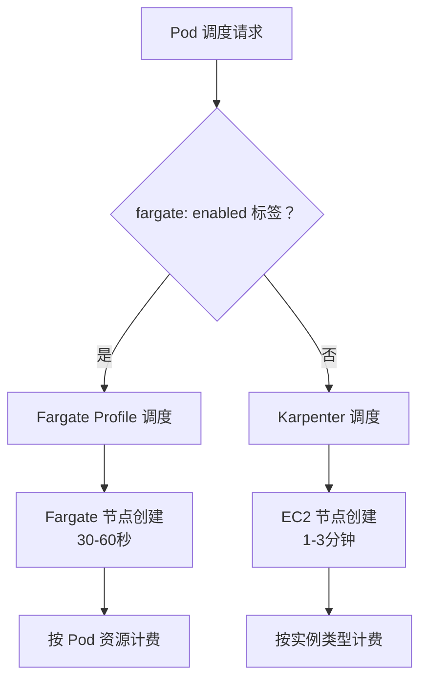

# EKS + Karpenter 完整部署指南

## 项目概述

本项目帮助 AWS 用户快速从零开始部署一套基于 Karpenter 的 EKS 集群环境，支持：
- eksctl 工具脚本化创建集群
- 跨多个 AZ 的节点调度
- 混合节点类型 (Fargate, Spot, On-Demand)
- EBS, EFS, S3 持久化存储
- S3 挂载 (Mountpoint for Amazon S3)
- Portainer Web 管理界面
- Pod Identity 认证机制

## 🔧 技术栈

- **AWS EKS**: 托管 Kubernetes 服务 (v1.33)
- **节点调度**: Fargate Profile + Karpenter v1.6.3
- **认证**: Pod Identity
- **存储**: EBS GP3, EFS, S3
- **网络**: ALB + Fargate
- **管理**: Portainer CE

## 📁 文件结构

```
/eks-env/
├── eks/                          # EKS集群部署文档及配置文件
│   ├── create-eks-cluster-guide.md     # 集群创建指南
│   ├── cluster-config.yaml             # 集群配置
│   ├── general-storageclasses.yaml     # 通用存储类配置
│   ├── iam_policy.json                 # LoadBalancer Controller策略
│   └── fix-eks-web-console-access.md   # Web控制台访问修复
├── karpenter/                    # Karpenter部署文档及配置文件
│   ├── karpenter-deployment-guide.md   # Karpenter部署指南
│   ├── karpenter-policy.json           # Karpenter权限策略
│   ├── karpenter-node-role-trust-policy.json
│   ├── nodepool-arm64.yaml             # ARM64节点池配置
│   └── nodepool-amd64.yaml             # x86-64节点池配置
├── portainer/                    # Portainer安装文档及配置文件  
│   ├── portainer-deployment-guide.md   # Portainer部署指南
│   ├── portainer-deployment.yaml       # Portainer部署配置
│   ├── portainer-efs-storageclass.yaml # EFS存储类
│   └── portainer-efs-pvc.yaml          # EFS持久卷声明
├── tests/                        # 测试组件   
│   ├── test-alb-ingress.yaml           # ALB Ingress 测试
│   ├── test-efs-storage.yaml           # EFS 存储测试
│   ├── test-s3-storage.yaml            # S3 存储测试
│   ├── test-gp3-storage-karpenter.yaml # GP3 存储测试
│   └── test-karpenter-simple.yaml      # Karpenter 简单测试
└── README.md                     # 项目说明
```

## 🚀 快速开始

### 1. 创建 EKS 集群
```bash
# 参考详细指南
eks/create-eks-cluster-guide.md
```

### 2. 部署 Karpenter
```bash
# 已验证详细指南
karpenter/karpenter-deployment-guide.md
```

### 3. 部署 Portainer (可选)
```bash
# 已验证详细指南
portainer/portainer-deployment-guide.md
```

## 🏛️ EKS 节点调度策略说明

本项目采用 **Fargate + Karpenter 混合架构**，根据工作负载特性选择最适合的调度方式：

### Fargate Profile vs Karpenter 对比

| 特性 | Fargate Profile | Karpenter |
|------|----------------|-----------|
| **调度方式** | 标签匹配调度 | 资源需求驱动 |
| **节点类型** | Fargate (无服务器) | EC2 (可管理) |
| **节点管理** | 无需管理 | 需要管理 |
| **Pod 密度** | 1 Pod/节点 | 多 Pod/节点 |
| **扩展速度** | 30-60 秒 | 1-3 分钟 |
| **计费方式** | 按 Pod 资源请求 | 按实例类型 |
| **Spot 支持** | ❌ (仅 ECS 支持) | ✅ (70% 成本节省) |
| **成本效率** | 小规模高效 | 大规模高效 |
| **管理复杂度** | 低 | 中等 |

### 集群部署架构设计原则

1. **管理组件** → Fargate (稳定、安全)
2. **数据平面** → Karpenter (灵活、经济)
3. **存储控制器** → EC2 (特权要求)
4. **应用负载** → 混合 (按需选择)

### 场景选择指南

#### **🎯 Fargate Profile 适用场景**：
- **系统组件** - Karpenter Controller, LoadBalancer Controller
- **管理工具** - Portainer, 监控组件
- **间歇性任务** - CI/CD Jobs, 定时任务
- **安全敏感** - 需要强隔离的应用
- **不想管理节点** - 无服务器体验

#### **🚀 Karpenter 适用场景**：
- **应用工作负载** - Web 服务, API 服务
- **批处理任务** - 数据处理, 机器学习
- **成本敏感** - 需要 Spot 实例的场景
- **高密度部署** - 微服务集群
- **特殊节点配置** - 自定义 AMI, 实例类型

### 调度决策流程



### 标签控制示例

```yaml
# Fargate 调度 - 系统组件
apiVersion: apps/v1
kind: Deployment
metadata:
  name: karpenter
  namespace: karpenter
spec:
  template:
    metadata:
      labels:
        fargate: enabled  # 触发 Fargate Profile
    spec:
      containers:
      - name: controller
        # ...

---
# Karpenter 调度 - 应用负载
apiVersion: apps/v1  
kind: Deployment
metadata:
  name: web-app
spec:
  template:
    spec:
      # 无 fargate 标签，由 Karpenter 调度到 EC2
      containers:
      - name: nginx
        # ...
```

### Fargate on EKS

**Fargate 特性说明**

1. **"1 Pod = 1 Node"** - 每个 Pod 分配独立的计算资源
2. **安全隔离优先** - 每个 Pod 运行在独立的计算环境中，不共享 Fargate 节点
3. **无服务器体验** - 用户无需管理底层节点
4. **按需精确计费** - 只为实际请求的资源付费 (基于 Pod 的 `resources.requests` 配置)

**Fargate Spot 说明**

- **Fargate Spot 仅支持 ECS** - EKS 目前不支持 Fargate Spot
- **ECS Fargate Spot** 可节省高达 70% 成本
- **EKS 用户** 需要使用 EC2 Spot 实例获得成本优势

**参考资料**：
* [AWS Fargate Spot 定价](https://aws.amazon.com/fargate/pricing/) 
* [Fargate Spot 博客](https://elasticscale.com/blog/aws-fargate-spot-cost-optimization-with-managed-container-workloads/)
* [AWS Repost 问答](https://repost.aws/questions/QU8FN4Cq-uQsqA44XbF0pwfA/eks-fargate-one-pod-one-node)
