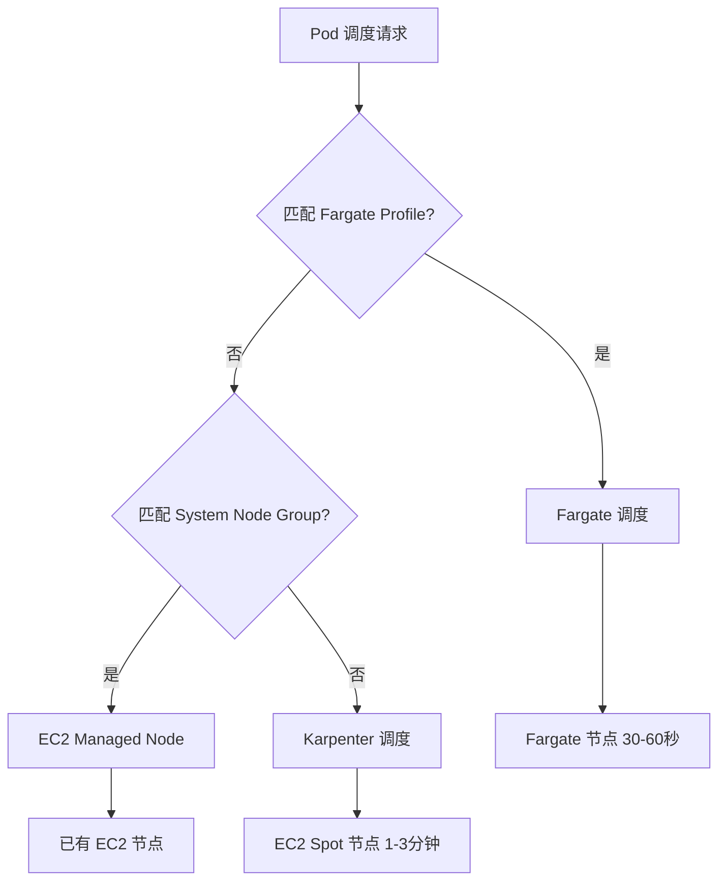

# EKS + Karpenter 完整部署指南

## 项目概述

本项目帮助 AWS 用户快速从零开始部署一套基于 Karpenter 的 EKS 集群环境，支持：
- eksctl 工具脚本化创建集群
- 跨多个 AZ 的节点调度
- 混合节点类型 (Fargate, Spot, On-Demand)
- EBS, EFS, S3 持久化存储
- S3 挂载 (Mountpoint for Amazon S3)
- Portainer Web 管理界面
- Pod Identity 认证机制
- GPU 推理工作负载 (NVIDIA Time-Slicing)

## 🔧 技术栈

- **AWS EKS**: 托管 Kubernetes 服务 (v1.35)
- **节点调度**: EC2 System Node Group (Spot) + Karpenter v1.9.0
- **认证**: Pod Identity
- **存储**: EBS GP3, EFS, S3
- **网络**: ALB
- **管理**: Portainer CE
- **GPU**: NVIDIA Device Plugin + Time-Slicing

## 📁 文件结构

```
/eks-env/
├── eks/                          # EKS集群部署文档及配置文件
│   ├── create-eks-cluster-guide.md     # 集群创建指南
│   ├── cluster-config.yaml             # 集群配置
│   ├── cluster-config-ngs.yaml         # Node Group 配置
│   ├── nodegroup-system.yaml           # System Node Group 配置
│   ├── general-storageclasses.yaml     # 通用存储类配置
│   ├── iam_policy.json                 # LoadBalancer Controller策略
│   └── fix-eks-web-console-access.md   # Web控制台访问修复
├── karpenter/                    # Karpenter部署文档及配置文件
│   ├── karpenter-deployment-guide.md   # Karpenter部署指南
│   ├── karpenter-interruption-handling-guide.md  # Spot中断处理指南
│   ├── karpenter-policy.json           # Karpenter权限策略
│   ├── karpenter-node-role-trust-policy.json
│   ├── karpenter-irsa-trust-policy.json
│   ├── nodepool-arm64.yaml             # ARM64节点池配置
│   └── nodepool-amd64.yaml             # x86-64节点池配置
├── gpu/                          # GPU支持部署文档及配置文件
│   ├── gpu-deployment-guide.md         # GPU部署指南
│   ├── nodepool-gpu.yaml               # GPU节点池配置
│   ├── nvidia-device-plugin.yaml       # NVIDIA Device Plugin配置
│   ├── nvidia-time-slicing-config.yaml # GPU Time-Slicing配置
│   └── local-storage-class.yaml        # 本地存储类
├── tools/                        # 集群管理工具
│   ├── aperf/                          # APerf性能分析工具（Job模式）
│   ├── portainer/                      # Portainer容器管理工具
│   └── monitoring/                     # Prometheus监控
├── applications/                 # 业务应用
│   ├── qwen3-speech/                   # Qwen3 ASR 语音识别
│   ├── voxcpm2-tts/                    # VoxCPM2 TTS 语音合成 (OpenAI兼容)
│   ├── bitwarden/                      # Bitwarden密码管理
│   ├── convertx/                       # ConvertX文件转换
│   └── auto-draw-io/                   # Auto-Draw-IO
├── tests/                        # 测试组件
│   ├── test-alb-ingress.yaml           # ALB Ingress 测试
│   ├── test-storage-efs.yaml           # EFS 存储测试
│   ├── test-storage-s3.yaml            # S3 存储测试
│   ├── test-storage-gp3.yaml          # GP3 存储测试
│   ├── test-karpenter-simple.yaml      # Karpenter 简单测试
│   ├── test-gpu-simple.yaml            # GPU 基础检测测试
│   ├── test-gpu-pytorch.yaml           # PyTorch GPU 功能测试
│   └── test-gpu-nvme.yaml              # GPU + NVMe 存储测试
├── docs/                         # 项目文档
│   ├── karpenter-multi-ebs-best-practices.md  # Karpenter最佳实践
│   └── oss-tts-model-latency-benchmark.md     # TTS模型延迟对比
└── README.md                     # 项目说明文档
```

## 🚀 快速开始

### 1. 创建 EKS 集群
```bash
# 参考详细指南
eks/create-eks-cluster-guide.md
```

### 2. 部署 Karpenter
```bash
# 已验证详细指南
karpenter/karpenter-deployment-guide.md
```

### 3. 部署 GPU 支持 (可选)
```bash
# 已验证详细指南
gpu/gpu-deployment-guide.md
```

### 4. 部署集群管理工具 (可选)
```bash
# 部署 Portainer 容器管理界面
tools/portainer/portainer-deployment-guide.md

# 部署 APerf 性能分析工具（Job模式）
tools/aperf/aperf-deployment-guide.md
```

### 5. 部署 AI 推理服务 (可选)
```bash
# Qwen3 ASR 语音识别
applications/qwen3-speech/qwen3-speech-deployment-guide.md

# VoxCPM2 TTS 语音合成 (OpenAI兼容接口)
applications/voxcpm2-tts/README.md
```

## 🏛️ EKS 节点调度策略说明

本项目采用 **EC2 Spot + Karpenter 混合架构**，根据工作负载特性选择最适合的调度方式：

### Fargate Profile vs Karpenter 对比

| 特性 | Fargate Profile | Karpenter |
|------|----------------|-----------|
| **调度方式** | 标签匹配调度 | 资源需求驱动 |
| **节点类型** | Fargate (无服务器) | EC2 (可管理) |
| **节点管理** | 无需管理 | 需要管理 |
| **Pod 密度** | 1 Pod/节点 | 多 Pod/节点 |
| **扩展速度** | 30-60 秒 | 1-3 分钟 |
| **计费方式** | 按 Pod 资源请求 | 按实例类型 |
| **Spot 支持** | ❌ (仅 ECS 支持) | ✅ (70% 成本节省) |
| **成本效率** | 小规模高效 | 大规模高效 |
| **管理复杂度** | 低 | 中等 |

> 注: eks-karpenter-env 已从 Fargate 迁移至 EC2 Spot System Node Group，成本降低约 85%。

### 集群部署架构设计原则

1. **系统组件** → EC2 Spot Node Group (稳定、经济)
2. **数据平面** → Karpenter (灵活、经济)
3. **GPU 推理** → Karpenter GPU NodePool (Spot, Time-Slicing)
4. **应用负载** → 混合 (按需选择)

### 场景选择指南

#### **🎯 EC2 System Node Group 适用场景**：
- **系统组件** - Karpenter Controller, LoadBalancer Controller
- **管理工具** - Portainer, 监控组件
- **CSI 驱动** - EBS/EFS/S3 CSI Controller

#### **🚀 Karpenter 适用场景**：
- **应用工作负载** - Web 服务, API 服务
- **批处理任务** - 数据处理, 机器学习
- **GPU 推理** - ASR, TTS 等 AI 服务
- **成本敏感** - 需要 Spot 实例的场景
- **高密度部署** - 微服务集群
- **特殊节点配置** - 自定义 AMI, 实例类型

### Fargate on EKS

**调度决策流程**


```mermaid
graph TD
    A[Pod 调度请求] --> B{匹配 Fargate Profile?}
    B -->|是| C[Fargate 调度]
    B -->|否| D{匹配 System Node Group?}
    D -->|是| E[EC2 Managed Node]
    D -->|否| F[Karpenter 调度]
    C --> G[Fargate 节点 30-60秒]
    E --> H[已有 EC2 节点]
    F --> I[EC2 Spot 节点 1-3分钟]
```

**标签控制示例**

```yaml
# Fargate 调度 (inference-env 系统组件)
metadata:
  labels:
    fargate: enabled  # 匹配 Fargate Profile

# Karpenter 调度 (GPU 推理)
spec:
  nodeSelector:
    node-type: gpu    # 匹配 GPU NodePool
  tolerations:
  - key: nvidia.com/gpu
    operator: Equal
    value: "true"
    effect: NoSchedule
```

**Fargate 特性说明**

1. **"1 Pod = 1 Node"** - 每个 Pod 分配独立的计算资源
2. **安全隔离优先** - 每个 Pod 运行在独立的计算环境中，不共享 Fargate 节点
3. **无服务器体验** - 用户无需管理底层节点
4. **按需精确计费** - 只为实际请求的资源付费 (基于 Pod 的 `resources.requests` 配置)

**Fargate Spot 说明**

- **Fargate Spot 仅支持 ECS** - EKS 目前不支持 Fargate Spot
- **ECS Fargate Spot** 可节省高达 70% 成本
- **EKS 用户** 需要使用 EC2 Spot 实例获得成本优势

**参考资料**：
* [AWS Fargate Spot 定价](https://aws.amazon.com/fargate/pricing/) 
* [Fargate Spot 博客](https://elasticscale.com/blog/aws-fargate-spot-cost-optimization-with-managed-container-workloads/)
* [AWS Repost 问答](https://repost.aws/questions/QU8FN4Cq-uQsqA44XbF0pwfA/eks-fargate-one-pod-one-node)
